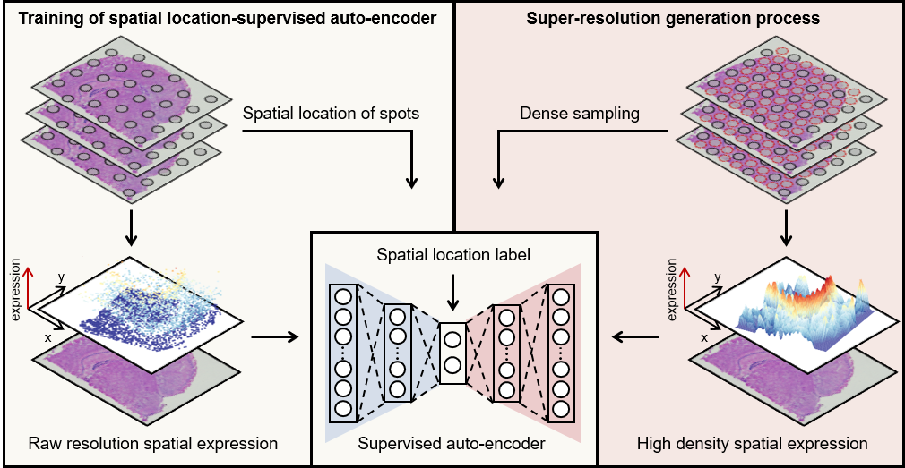

# STAGE

## Overview
STAGE is designed for high-density generation for spatially resolved transcriptomics data. STAGE learns low-dimensional latent embeddings 
to fit spatial information for gene expression data. The method adopts 
specific loss functions to generate meaningful gene expression data. 
Specifically, the latent layer adopts weighted sum of $L_{1}$ loss and [sliced
Wasserstein distance](https://ieeexplore.ieee.org/document/8578465) between latent embeddings and spatial locations, 
while the ouput layer adopts weighted sum of $L_{2}$ loss and $L_{1}$ loss between reconstructed and original data. The high-density data can be generated 
by the decoder of STAGE. STAGE can be applied for gene patterns enhancement, 
gene modules identification, and 3D generation. 



## Prerequisites
It is recommended to use a Python version between `3.7` and `3.9`.

## Software dependencies
scanpy>=1.8.2,<=1.9.6

torch>=1.8.0,<=1.13.0

torchvision>=0.9.0,<=1.14.1

In addition, if you choose to use GPU, the versions of torch and torchvision 
need to be compatible with the version of CUDA.

## Installation
After download STAGE from [Github](https://github.com/zhanglabtools/STAGE), you can install STAGE via
```
cd STAGE-main
python setup.py build
python setup.py install
```
In addition, if you choose to install STAGE in a virtual environment, 
you must install the imageio and igraph packages first. 

## Tutorials
The following are detailed tutorials. Some related additional files can be downloaded [here](https://drive.google.com/drive/folders/1yLMezhggFhhyKMqc23MUDm8hh2y8jPpx).

1. [Recovery of down-sampled data on human DLPFC 10x datasets](./tutorials/T1_DLPFC_recovery.ipynb)

2. [Gene patterns enhancement on mouse brain 10x dataets](./tutorials/T2_mouse_brain.ipynb)

3. [Gene modules identification on human PDAC Spatial Transcriptomics datasets](./tutorials/T3_PDAC.ipynb)

4. [Tissue structure segmentation on human breast cancer 10x datasets](./tutorials/T4_breast_cancer.ipynb)

5. [3D generation on mouse olfatory bulb Slide-seq datasets](./tutorials/T5_3d_model.ipynb)

