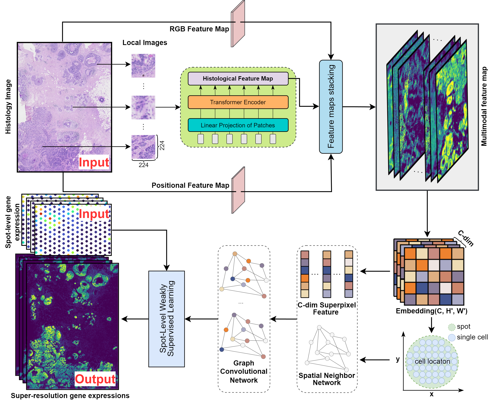

# scstGCN
## Overview
Ideal ST data should have single-cell resolution and cover the entire tissue surface,but generating such ST data with existing platforms remains challenging scstGCN is a GCN-based method that leverages a weakly supervised learning framework to integrate multimodal information and then infer super-resolution gene expression at single-cell level. It first extract high-resolution multimodal feature map, including histological feature map, positional feature map, and RGB feature map. and then use the GCN module to predict super-resolution gene expression from multimodal feature map by a weakly supervised framework. scstGCN can predict super-resolution gene expression accurately, aid researchers in discovering biologically meaningful differentially expressed genes and pathways. Additionally, it can predict expression both outside the spots and in external tissue sections.

## Installations
- NVIDIA GPU (a single Nvidia GeForce RTX 3090)
- `pip install -r requiremnt.txt`

## Data
All the datasets used in this paper can be downloaded from url：[https://zenodo.org/records/12800375](https://zenodo.org/records/12800375).
### Data format
- `he-raw.jpg`: The original histological image.
- `cnts.csv`: Spot-based gene expression data, where each row represents a spot and each column represents a gene.
- `locs-raw.csv`: All spots’ two-dimensional coordinates information, where each row represents a spot corresponding to `cnts.csv`. The first and second columns in this files represent x-coordinate and y-coordinate, respectively. The units of coordinates information are pixels corresponding to the histological image.
- `pixel-size-raw.txt`: The actual physical size corresponding to each pixel in the histological image, measured in micrometers.
- `radius-raw.txt`: The number of pixels in histological image corresponding to the radius of a spot.

## Getting access
In our multimodal feature mapping extractor, the ViT architecture utilizes a self-pretrained model called UNI. You need to request access to the model weights from the Huggingface model page at:[https://huggingface.co/mahmoodlab/UNI](https://huggingface.co/mahmoodlab/UNI).

## Running demo
We provide a examples for predicting super-resolution gene expression data of 10X Visium human dorsolateral prefrontal cortex tissue, please refer to [demo.ipynb](demo.ipynb).
